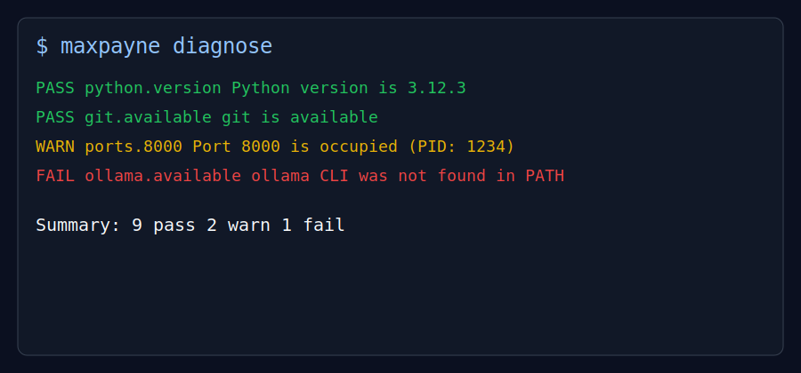

# MaxPayne

MaxPayne is a local developer environment doctor. It diagnoses and heals common setup pain before it breaks projects.
MaxPayne is tested without requiring Docker, Node, Git, or Ollama to be installed.

## Quick visuals




## Installation

```bash
python3 -m pip install -e .
maxpayne diagnose
```

## Usage examples

```bash
# Diagnose everything
maxpayne diagnose

# Export machine-readable report
maxpayne report --output ./artifacts/maxpayne-report.json

# Focused doctors
maxpayne doctor python
maxpayne doctor git
maxpayne doctor docker
maxpayne doctor ollama
maxpayne doctor windows

# Heal common issues
maxpayne heal
maxpayne heal --interactive
maxpayne heal git
maxpayne heal env
maxpayne heal port 8000
maxpayne heal dependency fastapi

# Explain stack traces with local Ollama (falls back to heuristic mode)
maxpayne explain crash.log
maxpayne explain traceback.txt
```

## Feature matrix

| Capability | Diagnose | Heal | Explain |
|---|---:|---:|---:|
| Python / pip checks | ✅ | ➖ | ➖ |
| Git / Node / Docker / Ollama checks | ✅ | Git ✅ | ➖ |
| Port occupancy with PID/process | ✅ | ✅ | ➖ |
| `.env` / `.env.example` workflow | ✅ | ✅ | ➖ |
| Windows pain checks (WSL, PATH, runtimes, launcher) | ✅ | ➖ | ➖ |
| JSON report export | ✅ | ➖ | ➖ |
| Crash log plain-English explanations | ➖ | ➖ | ✅ |

## Roadmap

- [x] MVP diagnostics (`diagnose`, `doctor`, `ports`)
- [x] JSON report export (`report`)
- [x] Heal mode (`heal` commands)
- [x] Local AI explain mode (`explain`)
- [ ] richer auto-fix recipes (toolchain bootstrap profiles)
- [ ] CI/CD check bundle presets
- [ ] publish to PyPI

## Development

```bash
python3 -m pip install -e ".[dev]"
pytest
```

## Contributing

1. Fork the repository and create a feature branch.
2. Add focused changes with tests.
3. Run `pytest` before opening a pull request.
4. Keep CLI behavior cross-platform and failure-tolerant.

## License

MIT — see [LICENSE](LICENSE).
