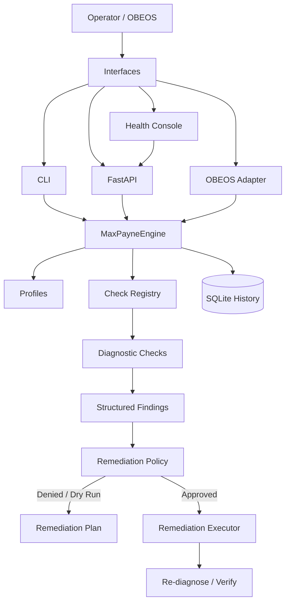
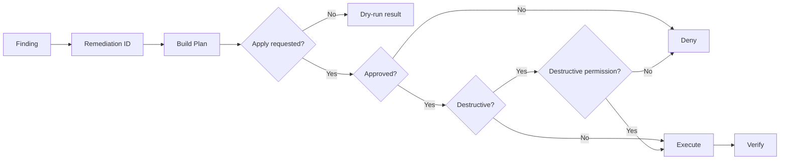
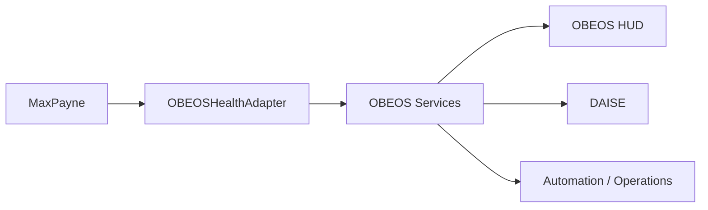

# MaxPayne Architecture

MaxPayne is a local-first developer environment health and recovery engine. The architecture intentionally separates **observation**, **interpretation**, and **mutation** so the same diagnostic core can be used safely from a terminal, a web interface, or an automation platform such as OBEOS.

## System overview



## Core responsibilities

### `MaxPayneEngine`

The engine is the stable application boundary. Callers should use the engine rather than importing individual checks directly.

Responsibilities:

- resolve a diagnostic profile or explicit check groups
- execute checks through the registry
- isolate failures so one broken check group does not terminate the scan
- generate scan metadata and summary counts
- optionally persist reports to history
- return machine-readable reports for any presentation layer

### Check registry

Checks are registered by capability instead of being embedded in the CLI. This keeps the core extensible and allows integrations to add new diagnostics without changing the presentation layer.

Current diagnostic domains include:

- Python
- Git
- Node
- Docker
- Ollama
- ports
- project environment
- Windows
- configurable service health

### Profiles

Profiles define useful bundles of checks for different operating contexts.

| Profile | Purpose |
|---|---|
| `minimal` | Fast foundational runtime checks |
| `workstation` | Developer workstation health |
| `obeos` | OBEOS-oriented system and service health |
| `all` | Every registered diagnostic group |

Profiles are configuration, not separate engines.

## Findings contract

Each diagnostic produces a structured finding rather than arbitrary terminal text. Findings can carry:

- stable check identifier
- status
- component
- severity
- human-readable message
- suggested next action
- diagnostic evidence
- observation timestamp
- execution duration
- remediation identifier
- whether an automatic fix exists
- remediation risk

This contract lets the CLI, API, dashboard, and OBEOS render the same underlying truth differently without duplicating diagnostic logic.

## Remediation boundary

Diagnosis and repair are deliberately separate.



This is particularly important for agent-driven integrations. OBEOS may be allowed to ask **what is broken** without being granted permission to change the host.

## History

MaxPayne can persist diagnostic reports in SQLite. History enables future features such as:

- recurrent failure detection
- health trends
- mean time between repeated failures
- remediation effectiveness
- node-level reliability summaries

SQLite is intentionally sufficient for a local-first single-node installation. A distributed OBEOS deployment can aggregate snapshots at a higher layer without forcing MaxPayne itself to depend on a central database.

## OBEOS integration

MaxPayne remains an independent package. OBEOS consumes it through a narrow adapter.



Responsibilities remain separate:

- **MaxPayne:** system and developer-runtime health, diagnostics, recovery planning
- **Sentinel:** security posture, exposure, suspicious activity, and risk
- **DAISE:** explanation, reasoning, and operator communication
- **OBEOS:** orchestration and policy across nodes and services

## Failure behavior

A health tool must degrade safely.

- A crashed check group becomes a failed diagnostic finding rather than crashing the scan.
- Missing optional tools should produce bounded PASS/WARN/FAIL results instead of import-time failure.
- Ollama is optional; deterministic explanations remain available.
- History failure should not make core diagnostics unusable.
- Remediation is denied when the policy contract is not satisfied.
- Remote service probes must time out and return bounded evidence.

## Scalability path

MaxPayne does not need to become a distributed control plane. The scalable model is one local MaxPayne instance per node with OBEOS aggregating health snapshots.

```text
BLACKCOMPUTER ─ MaxPayne ─┐
LEGION        ─ MaxPayne ─┤
EC2           ─ MaxPayne ─┼─ OBEOS Health Aggregation
Pi / Node     ─ MaxPayne ─┘
```

This preserves local diagnostics, minimizes privileged remote execution, and keeps failure domains isolated.

## Design principles

1. **Deterministic first.** Diagnostics must not depend on an LLM.
2. **Local first.** Machine health information should stay local unless an integration explicitly exports it.
3. **AI is optional.** Models enhance explanations; they are not the source of diagnostic truth.
4. **Failure containment.** A broken check must not break the health engine.
5. **Default-deny remediation.** Observation does not imply permission to mutate.
6. **Machine-readable contracts.** CLI, API, UI, and OBEOS share the same structured results.
7. **Small core, extensible edges.** New checks and integrations should not require redesigning the engine.